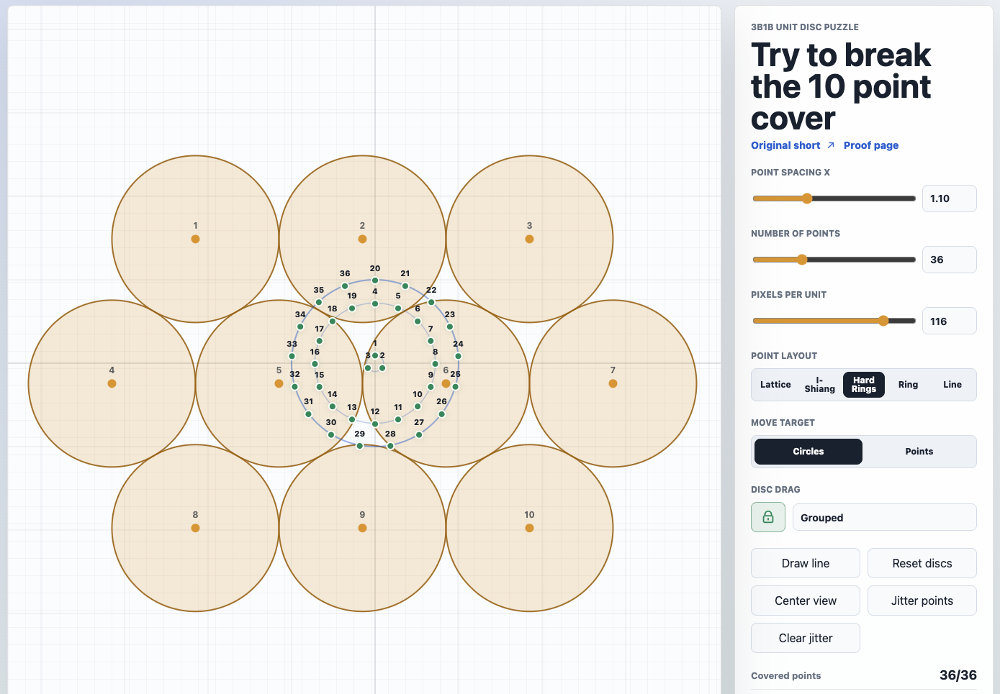

# Circles

An interactive single-page canvas app for exploring the 3Blue1Brown short about covering plane points with disjoint unit discs.

Source puzzle: [3B1B YouTube Short](https://www.youtube.com/shorts/QLu_ZsRc_G0)



## What It Does

- Draws 10-100 configurable points in the plane.
- Draws 10 unit discs in a staggered tangent packing.
- Lets you switch between moving circles and moving points.
- Lets you draw a freehand path and place points at equal path-length spacing along it.
- Includes an `I-Shiang` layout with two horizontal tangent virtual circles aligned to discs 5 and 6, a third tangent circle below, nine perimeter points in 10-point mode, and one center point.
- Lets you drag the full disc packing as a locked group by default.
- Lets you unlock the discs and drag individual unit discs.
- Shows live coverage count, overlap count, and closest point spacing.
- Supports lattice, ring, and line point layouts.

## Run Locally

This is a static app with no build step.

```sh
python3 -m http.server 4173
```

Then open:

```text
http://127.0.0.1:4173/
```

You can also open `index.html` directly in a browser.

## Controls

- `Point spacing X`: sets the distance scale for the point arrangement.
- `Number of points`: changes the point count from 10 to 100.
- `Pixels per unit`: zooms the canvas unit scale.
- `Point layout`: switches the point arrangement.
- `Move target`: switches canvas dragging between circles and points.
- `Draw line`: lets you draw a freehand path and places all points at equal arc-length spacing on that path.
- Arrow keys: nudge the last dragged point, disc, or grouped disc packing by one screen pixel.
- Lock icon: toggles grouped disc dragging versus individual disc dragging.
- `Reset discs`: restores the staggered tangent disc packing.
- `Center view`: recenters the canvas.
- `Jitter points`: perturbs the points slightly.
- `Clear jitter`: restores the exact selected point layout, including manually moved points.
